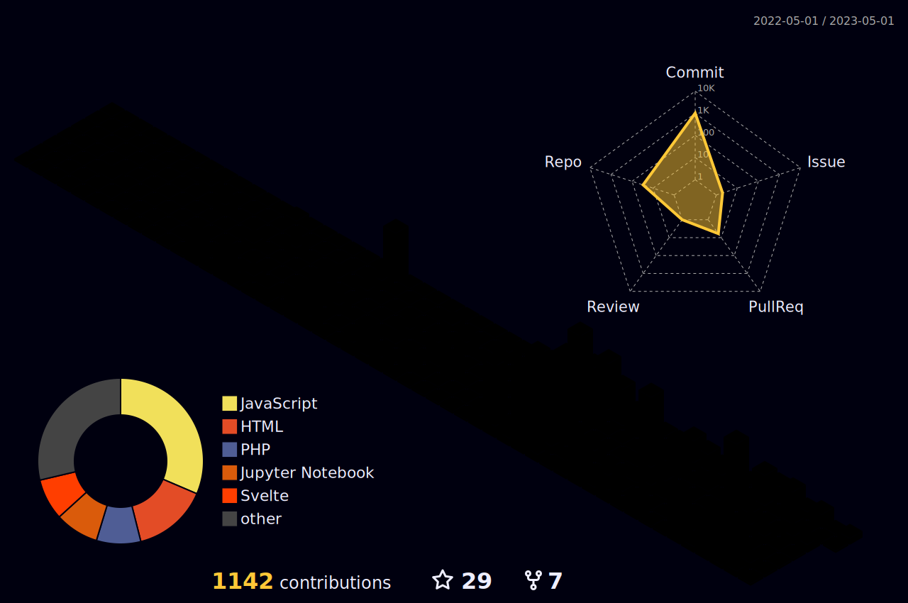

<h1 align="center">Hi 👋, I'm <a href="https://ajinkgupta.github.io/" target="blank">
Ajink</a></h1>
 

<h3 align="center">A passionate Web developer from Thane , India &#127470;&#127475</h3>

   
   
  
  
  

 

  

### 🛠 Frameworks and Tools I'm interested in

 

 </a>

### 📈 Github Contribution Graph

### ⚙️ Github Analytics

  
 
    
 
 
 
 
  

 
